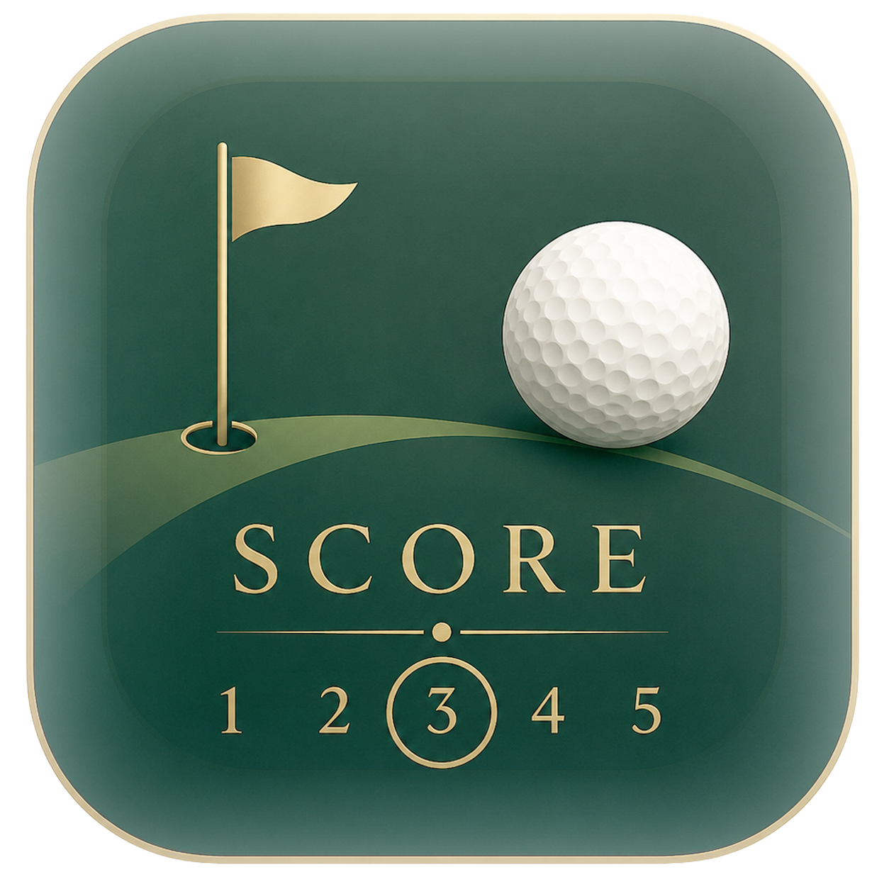

# ⛳ SA Golf Scorecard — Gav vs Phil

A single-page golf scorecard for match play + Stableford, with a course picker
for South African courses and optional live sync so both players see the same
card from different phones.

## Features

- **Match play + Stableford** scoring, net of handicap (stroke dots by index).
- **Course dropdown** — Kloof CC, Durban Country Club, Royal Johannesburg
  (East), King David Mowbray. The whole card (par, stroke index, tee distances)
  swaps to match the chosen course.
- **Tap-to-enter** scores; birdies/eagles ring automatically; won holes shade.
- **Live sync (optional)** via Supabase — share the `?game=` link and both
  phones update in real time. Works fully offline/local with no setup.
- **Game history** — pick a date, browse previous rounds, reopen any one to
  view or edit its scores, then jump back to the round in progress.
- **Installable** — "Add to Home Screen" gives it the app icon.

## Quick start

Just open `index.html` in a browser — it works immediately, saving scores to
that device.

For **live shared scoring** between two phones, follow **[SETUP.md](SETUP.md)**:
create the Supabase table (`supabase.sql`), paste your keys into `index.html`,
and host on GitHub Pages.

## Files

| File | Purpose |
|------|---------|
| `index.html` | Landing page (menu) |
| `scorecard.html` | The scorecard app + progress chart |
| `spend.html` | Spend tracker |
| `config.js` | Shared Supabase keys + version |
| `sw.js` | Service worker — offline cache + auto-update |
| `golf-icon.png` | App / favicon / home-screen icon |
| `supabase.sql` | Scores table + policies (+ `final` column) |
| `spend.sql` | Spend tracker table |
| `courses.sql` | Course catalogue tables + the six built-in courses |
| `SETUP.md` | Step-by-step Supabase + GitHub Pages setup |

## Hosting on GitHub Pages

Push this folder to a repo, then **Settings → Pages → Deploy from a branch →
`main` / root**. Your site goes live at
`https://<username>.github.io/<repo>/`.

## Course data

Par, stroke index and per-hole distances come from published scorecards,
converted to metres. Only courses with a full, verifiable hole-by-hole
scorecard are included. Add more by extending the `COURSES` object in
`index.html`.
